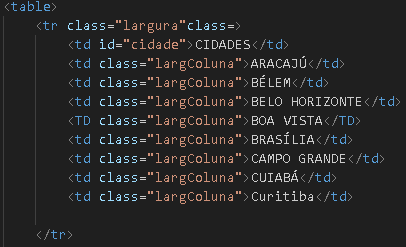
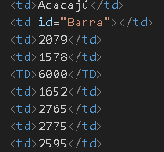
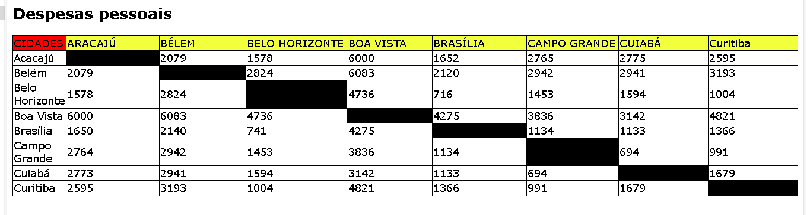

# Projeto - Tabela de distâncias entre capitais brasileiras

Projeto vriado como parte avaliativa de disciplina de Fundamentos de Desenvolvimento ministrada pelo professor Leonardo Rocha

## índice

*[Descrição](#descrição)  
*[Tecnologias](#tecnologias)  
*[Referência](#referências)  
*[Autor(a)](#autora)  

### Descrição

O projeto consiste na composição de uma tabela que conta com capitais brasileiras e a distância entre essas capitais. As capitais constantes nesse projeto são:

* Aracajú 
* Belém 
* Belo Horizonte
* Boa Vista
* Brasília
* Campo Grande
* Cuiabá
* Curitiba

### Resultado do projeto

#### Tabela 

* table - representa dados tabulares — isto é, informações apresentadas em uma tabela bidimensional composta por linhas e colunas de células contendo dados .
* tr - significa 'linha da tabela


Veja uma imagem de parte do código, onde é possível imdentificar uso dos elementos mencionadas acima:



* td -significa 'dados da tabela




 A seguir você vera a imagem do resultado final do projeto




### Estilização

O projeto foi estilizado, utilizando CSSS3. Foi criado um arquivo chamado style.css. Nesse arquivo, constam configurações de estilo apresentadas a seguir:

* Estilo de cores - A cor de fundo utilizada no projeto foi definida no projeto foi definida como segue:

```
largColuna{
    width: 200px;
    background-color: rgb(242, 255, 61);
}
```


## Tecnologias

* HTML5
* CSS3
* READE
* Git
* Github

## Referências 
[Alura](https://www.alura.com.br/artigos/escrever-bom-readme) - Como escrever um README incrível no seu Github

## Autor(a)
 O projeto foi desenvolvido por:

 * Kiara Messias
 * Isabella Alves
 * Rafaela Araujo
 * Vitor Eduardo
 * Caio Lovison
 * Miguel Gonçalves 
